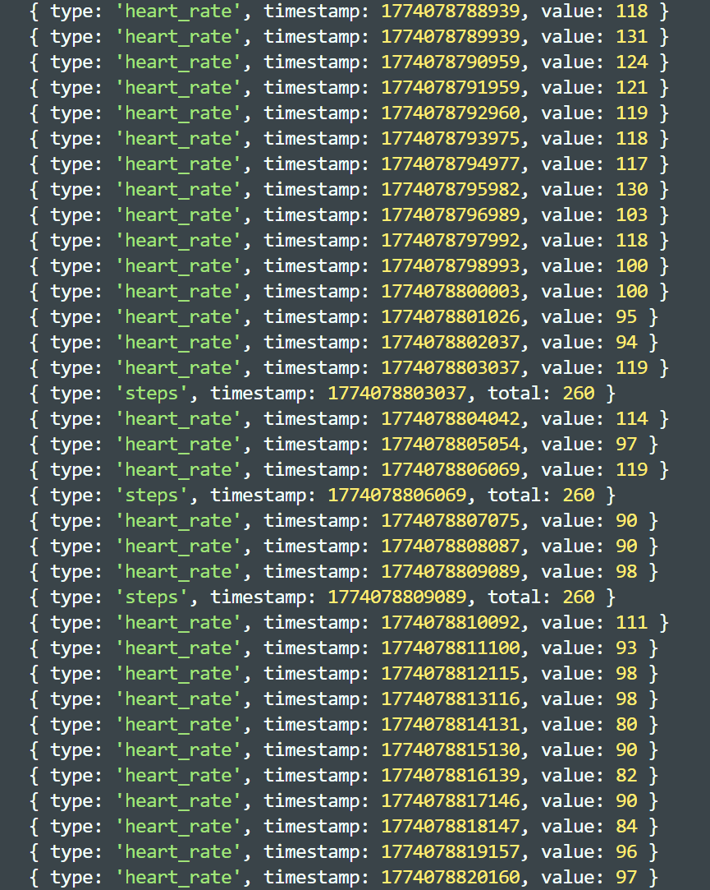
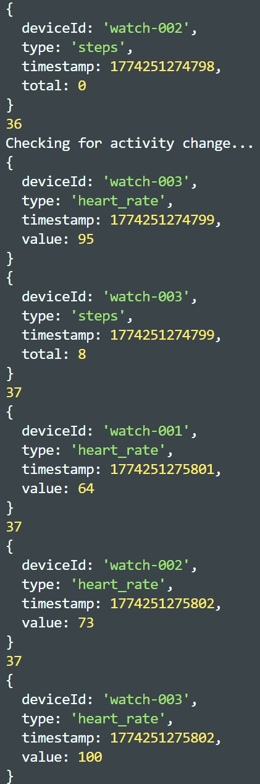
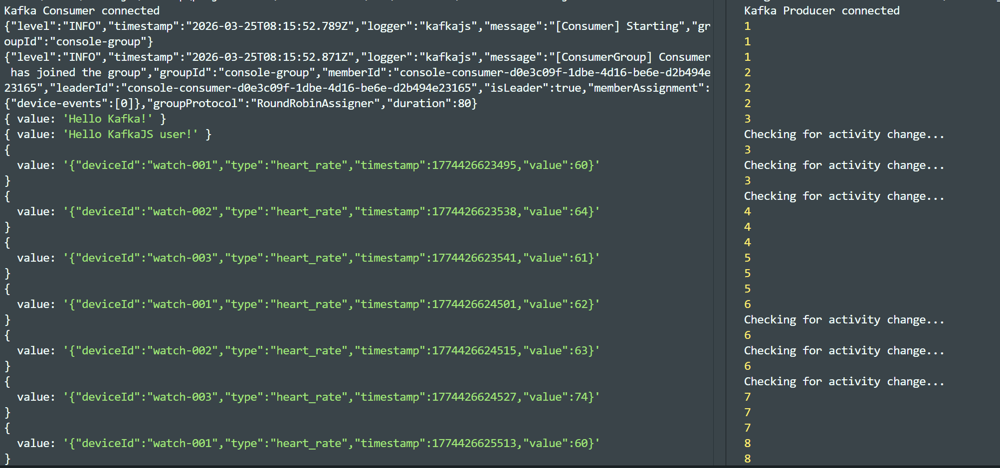
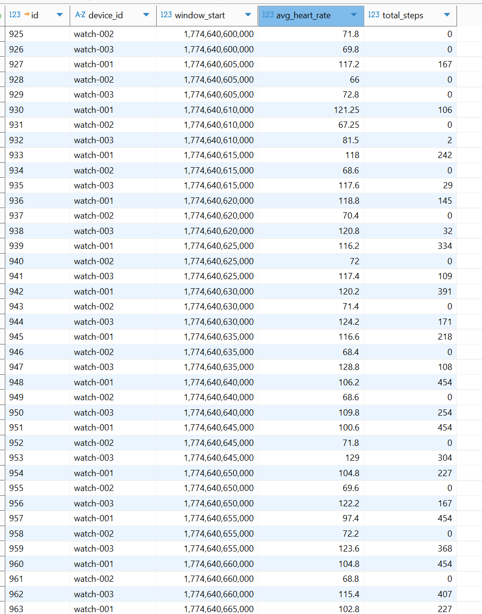

## KAFKA - SmartWatch simulator

The goal is understanding Kafka as a stream of events comes to it when there are different producers (smartwatches) and different consumers (storage, analytics, alerts)

21.03.2026

Shows a basic setup, steps and heart rate is changing based on some random factors. The smartwatch is not yet connected to anything but just logged out its state changes every seconds.

[commit 1c5f3ff71397c983c66812f498e2e3a063e3b3a0](https://github.com/dobby-ide/kafka-simulator/commit/1c5f3ff71397c983c66812f498e2e3a063e3b3a0)




22.03.2026
[commit 8367092727856bcc002cffa4e639cd3b22a3f442](https://github.com/dobby-ide/kafka-simulator/commit/8367092727856bcc002cffa4e639cd3b22a3f442)

tick variable is initialized to introduce a discrete simulation clock. An activity change log is introduced.

23.03.2026

Multiple watches are used.

[commit 4b78d080dd9d7c9a435af9b12a410200b876f643](https://github.com/dobby-ide/kafka-simulator/commit/4b78d080dd9d7c9a435af9b12a410200b876f643)




----------------------


This project runs Apache Kafka in KRaft mode, which means Kafka runs without ZooKeeper. The YAML file was actually found here: https://developer.confluent.io/confluent-tutorials/kafka-on-docker/

-------------

### Enter the Kafka container
```docker exec -it broker bash```

### Create topic
broker:/$ ```/opt/kafka/bin/kafka-topics.sh --create \
  --topic device-events \
  --bootstrap-server broker:29092```

### List topics
broker:/$ ```/opt/kafka/bin/kafka-topics.sh --list \
  --bootstrap-server localhost:9092```

### Produce a message
broker:/$ ```echo "Hello Kafka!" | /opt/kafka/bin/kafka-console-producer.sh \
  --bootstrap-server localhost:9092 \
  --topic device-events```

### Consume messages
broker:/$ ```/opt/kafka/bin/kafka-console-consumer.sh \
  --bootstrap-server localhost:9092 \
  --topic device-events \
  --from-beginning```


  ------------
  25.3.2026

  I choose to have only one topic in Kafka called device-events. And the consumer can filter by type (heart_rate, steps, activity_change etc.) Later this could be changed.
  I have modularized simulator.js, so the new starting point is src/simulator/index.js

[commit 1382bdaf355d7c014959c8e5918362f5e8d57cad](https://github.com/dobby-ide/kafka-simulator/commit/1382bdaf355d7c014959c8e5918362f5e8d57cad)




------------------
[commit 68c1063c3fb723e7e1e8e0df729f8089e79cea95](https://github.com/dobby-ide/kafka-simulator/commit/68c1063c3fb723e7e1e8e0df729f8089e79cea95)

src/simulator/index.js and src/consumers/consumerConsole.js needs to run independently along with the Kafka container.


27.3.2026

postgresConsumer.js has the ability to fetch and store events directly in a database. The file will store an average of heart rates or steps for each device in time frame of 5 seconds to avoid the database to grow too big too fast.


